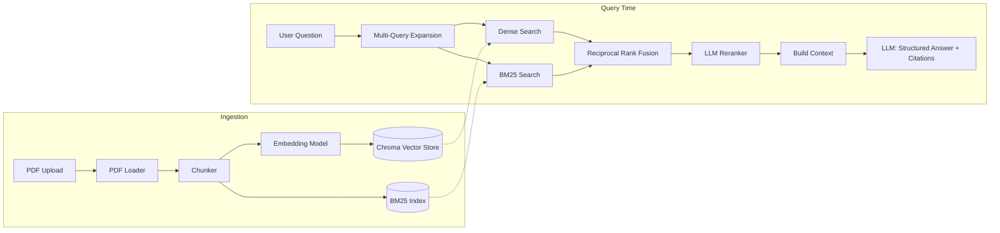

# Research Paper Assistant

A retrieval-augmented Q&A system over a collection of research papers, built
to demonstrate real retrieval engineering — not just "embed and prompt."

Upload PDFs of research papers and ask natural language questions across
your collection. Answers are structured and cited back to the specific
passages they came from.

## Course context

This project was built as the capstone for **Modern Data Engineering for
Advanced AI Systems**, part of [SDAIA Academy](https://github.com/SDAIAAcademy).
The brief asked for a full RAG application (code + README) demonstrating the
data engineering practices covered in the course — ingestion, chunking, and
retrieval over an AI system, not just a single LLM call. This
README documents the design decisions and trade-offs made to satisfy that
brief.

## Why this isn't a toy RAG demo

Most student RAG projects do: chunk → embed → cosine similarity → stuff into
a prompt. This one adds the pieces that actually matter for retrieval
quality and answer reliability in production systems:

| Component | What it does | Why it matters |
|---|---|---|
| **Hybrid retrieval** | Dense (Chroma embeddings) + sparse (BM25) search, merged with Reciprocal Rank Fusion | Dense search misses exact keyword/acronym matches (model names, dataset names); BM25 misses semantic paraphrases. Combining both beats either alone. |
| **Multi-query expansion** | LLM reformulates the question into several search queries before retrieving | A single phrasing of a question often misses relevant passages phrased differently in the source text. |
| **LLM reranking** | Shortlisted candidates are rescored for relevance before being used as context | Retrieval recall and retrieval precision are different problems — reranking fixes precision after a wide initial recall pass. |
| **Structured, cited output** | LLM is forced into a validated Pydantic schema (`answer`, `key_points`, `citations`, `confidence`) | Freeform text answers aren't reliable enough to build a product on. Structured output with per-claim citations is. |

## Architecture



## Project structure

```
app/
  config.py       - settings (env vars)
  schemas.py       - Pydantic models (API + LLM structured output)
  ingestion.py     - PDF loading, chunking
  vectorstore.py   - Chroma wrapper
  bm25_index.py    - BM25 sparse index
  retrieval.py     - hybrid search, RRF, multi-query, LLM reranker
  qa_engine.py     - orchestrates retrieval -> structured cited answer
  main.py          - FastAPI app and routes
frontend/
  streamlit_app.py  - minimal UI for ingestion + chat
```

## Setup

1. **Install dependencies**

   ```bash
   python -m venv .venv
   source .venv/bin/activate  # Windows: .venv\Scripts\activate
   pip install -r requirements.txt
   ```

2. **Configure environment**

   ```bash
   cp .env.example .env
   # then edit .env and set OPENROUTER_API_KEY
   ```

3. **Run the API**

   ```bash
   uvicorn app.main:app --reload
   ```

   Visit `http://localhost:8000/docs` for interactive API docs.

4. **Run the frontend** (optional, in a second terminal)

   ```bash
   streamlit run frontend/streamlit_app.py
   ```

## Usage

**Upload a PDF:**
```bash
curl -X POST http://localhost:8000/papers/ingest/upload \
  -F "file=@/path/to/paper.pdf" -F "title=My Paper"
```

**Ask a question:**
```bash
curl -X POST http://localhost:8000/chat \
  -H "Content-Type: application/json" \
  -d '{"question": "What method does this paper propose?", "top_k": 5}'
```

## Design notes / trade-offs

- **Chunking** uses a simple sliding word-window rather than semantic
  chunking, to keep the pipeline dependency-light. Swapping in a
  sentence/section-aware splitter is the most obvious next improvement.
- **Reranking** uses the chat LLM instead of a local cross-encoder model, to
  avoid downloading large models — a reasonable trade for a few-day project,
  worth revisiting for latency/cost at scale.
- **BM25 index** is rebuilt in memory on ingestion rather than persisted
  incrementally — fine at this scale, would need a real sparse index (e.g.
  Elasticsearch/OpenSearch) for a larger corpus.

## Possible extensions

- Fetch papers directly by arXiv ID instead of manual PDF upload
- Section-aware chunking (detect Abstract/Method/Results/Conclusion)
- Cross-paper comparison queries ("how do these two papers differ in X")
- Swap LLM reranker for a local cross-encoder for latency/cost
- Add an evaluation harness (retrieval hit-rate, answer grounding) to measure retrieval quality over time
